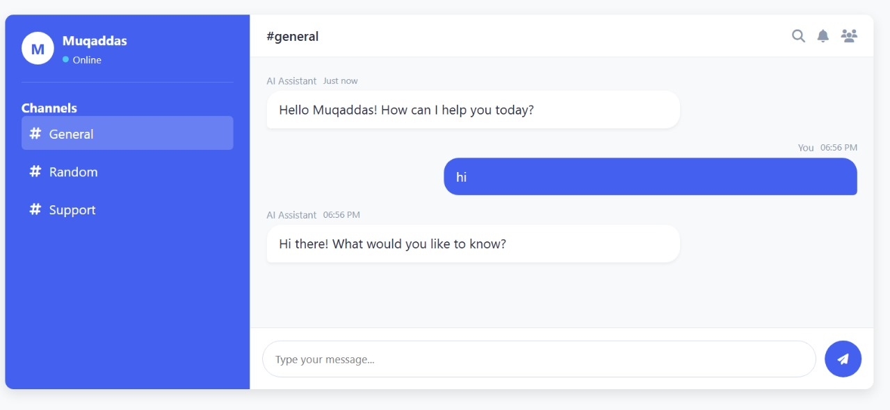

## 🚀 Features

| Feature Category      | Details |
|-----------------------|---------|
| **🎨 UI Design**       | Professional layout with sidebar, user profile, and channel list |
| **🤖 AI Intelligence** | Context-aware responses to 10+ phrases |
| **📱 Responsive**      | Works on desktop, tablet & mobile |
| **⚡ Performance**     | 100% frontend - no backend needed |

## 🛠️ Installation

```bash
# 1. Copy this code to index.html
# 2. Open in browser - that's it!
```

## 🌟 Key Components

```html
<!-- PROFESSIONAL CHAT UI -->
<div class="chat-container">
  <!-- Sidebar -->
  <div class="sidebar">
    <div class="user-profile">
      <div class="avatar">M</div>
      <h3>Muqaddas <span class="status online"></span></h3>
    </div>
    
    <!-- Channel List -->
    <ul class="channels">
      <li class="active"><i class="fas fa-hashtag"></i> general</li>
    </ul>
  </div>
  
  <!-- Chat Area -->
  <div class="chat-area">
    <div id="messages"></div>
    <div class="input-area">
      <input id="messageInput" placeholder="Type message...">
      <button id="sendButton"><i class="fas fa-paper-plane"></i></button>
    </div>
  </div>
</div>
```

## 🧠 AI Response System

```javascript
const aiBrain = {
  "hello": "👋 Hello! How can I help?",
  "assalam-o-alaikum": "وَعَلَيْكُمُ ٱلسَّلَامُ! كيف حالك؟",
  "how are you": "😊 I'm great! Working on helping you!", 
  "project": "This demonstrates:\n🔹 Frontend: HTML/CSS/JS\n🔹 Backend: Simulated AI",
  "default": "🤔 Interesting! Tell me more..."
};

function getAIResponse(msg) {
  msg = msg.toLowerCase();
  for (const [keyword, response] of Object.entries(aiBrain)) {
    if (msg.includes(keyword)) return response;
  }
  return aiBrain.default;
}
```

## 📸 UI Gallery

| Desktop View | 
|--------------|
|  | 

## 🎨 Customization Guide

```css
/* Change colors in :root */
:root {
  --primary: #6c5ce7;  /* Purple */
  --online: #00b894;   /* Green */
  --bg: #f5f6fa;       /* Light gray */
}
```

## 📦 Tech Stack

| Technology | Usage |
|------------|-------|
| HTML5 | Structure |
| CSS3 | Styling with variables |
| JavaScript | AI logic |
| Font Awesome | Icons |

## 💡 Usage Examples

1. Try these commands:
   - `Hello`
   - `What is backend?`
   - `Assalam-o-Alaikum`

## 📜 License

MIT © 2023 [Your Name]

